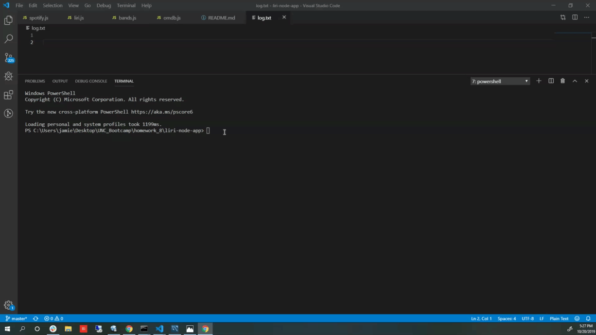
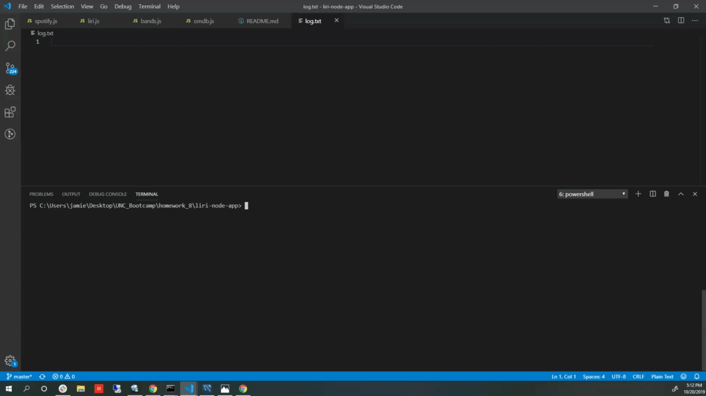
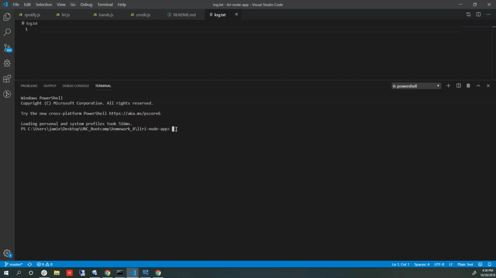
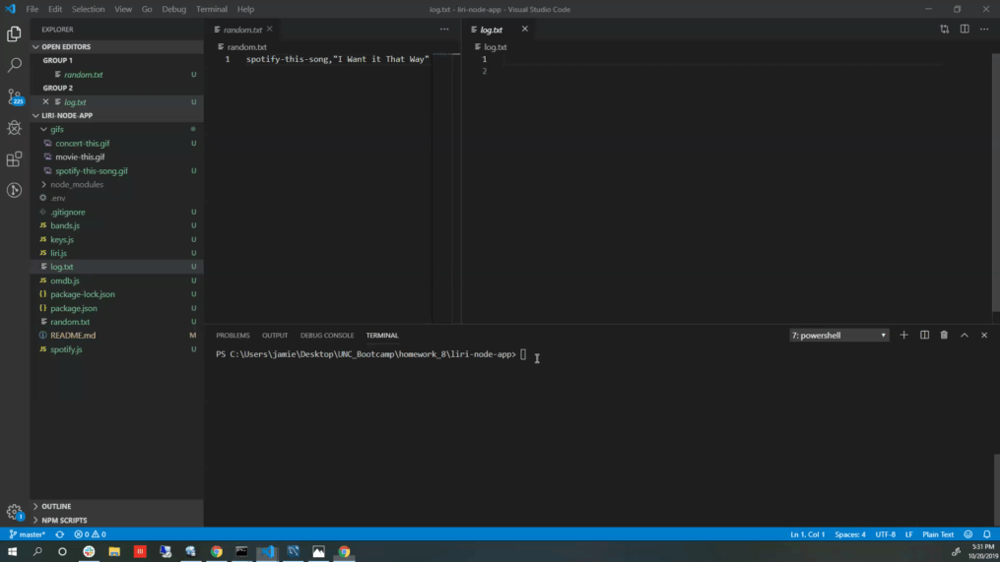
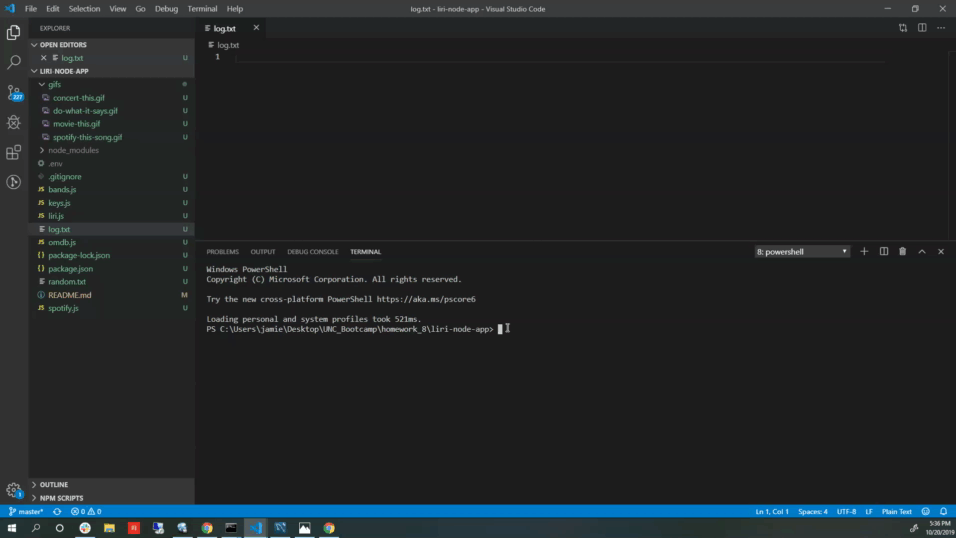

# liri-node-app

Application Overview: Liri is a Language Interpretation and Recognition Interface.  It is a command line node app that takes in two arguements and returns the JSON results from the corresponding API that is invoked.

Utility:  Liri allows a user to obtain information about movies, songs, and concerts.  It can also read a text file and pass the information in as the arguments.  The results will print to both the console as well as a log.txt file.

Instructions:  Liri has 4 possible functions:
  1.  Find movie data:
    - open command line prompt
    - type in "node liri movie-this title of movie" to get back results
    - ex. "node liri movie-this interview with a vampire"
    - click link for gif walk-through:
    
  
  2.  Find song data:
    - open command line prompt
    - type in "node liri spotify-this-song name of song" to get back results
    - ex. "node liri spotify-this-song purple haze"
    - click link for gif walk-through:
    

  3.  Find concert data:
    - open command line prompt
    - type in "node liri concert-this band name"
    - ex. "node liri concert-this ween"
    - click link for gif walk-through:
    

  4.  Read random.txt and return results:
    - open command line prompt
    - type in "node liri do-what-it-says
    - click link for gif walk-through:
    

  *********Click below link to see the default modes when user does not specify arguements:
      
    - 

Technologies Deployed: 
  1. node.js (platform for executing JavaScript code server-side)
  2. npm - axios (to access OMDB API & Bands in Town API)
  3. npm - node-spotify-api (to access spotify API)
  4. .env - this file allows api key and secret to be stored in a separate environment
  5. .gitignore - this file allows developer to choose which files not to upload to the repository (API password and client secret as well as the cumbersome node_modules file)
  3. fs.read (node method used to read random.txt)
  4. fs.append (method is used to append files to log.txt)

Created by: Jamie O'Neill